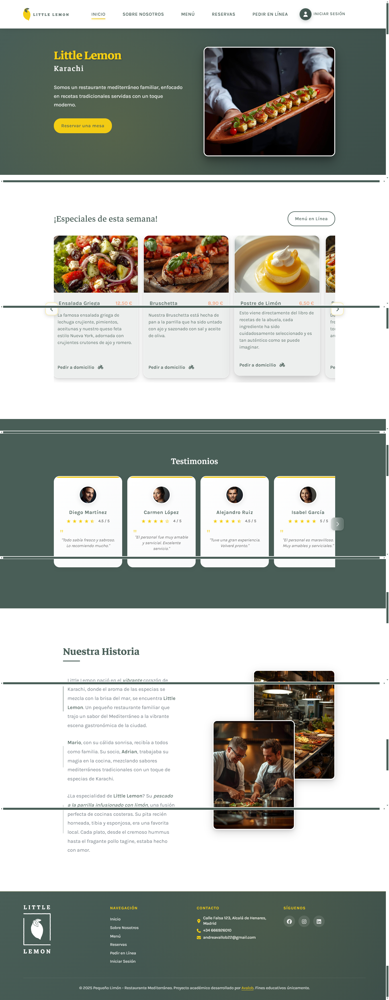
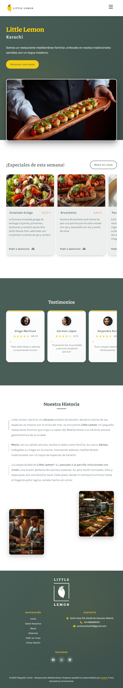
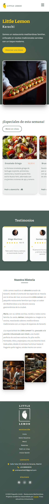
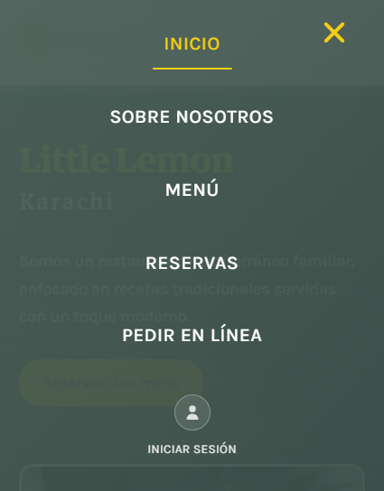
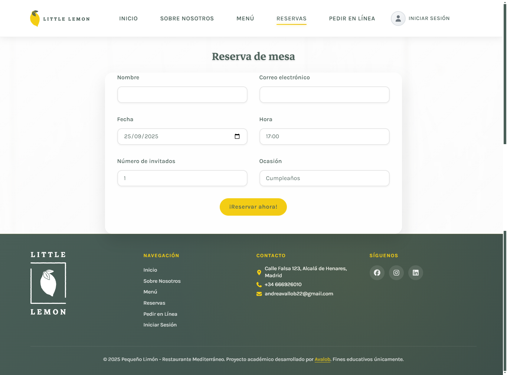

# 🍋 Little Lemon - Restaurante Mediterráneo

[](https://reactjs.org/)
[](https://www.emailjs.com/)
[](#testing)
[](#responsive-design)

> **Proyecto del Meta Frontend Developer Professional Certificate** desarrollado por Andrea Valbuena - Sitio web completo para restaurante mediterráneo con sistema de reservas funcional y diseño responsive, siguiendo los estándares profesionales de Meta.

## 📋 Descripción del Proyecto

Little Lemon es una aplicación web moderna desarrollada en **React** como proyecto final del **Meta Frontend Developer Professional Certificate**. Simula el sitio web de un restaurante mediterráneo siguiendo las mejores prácticas enseñadas por Meta. El proyecto incluye un sistema completo de reservas con envío de emails, diseño responsive, navegación intuitiva y características avanzadas de UX/UI.

### 🎯 Objetivos Académicos Cumplidos

- ✅ **Diseño UX/UI profesional** con paleta coherente y efectos modernos
- ✅ **Accesibilidad web** con ARIA labels y estructura semántica
- ✅ **Testing unitario** con 7/7 tests pasando correctamente
- ✅ **Formulario funcional** con validación y EmailJS
- ✅ **HTML semántico** y diseño responsive
- ✅ **Gestión de repositorio** Git con commits organizados

## 🎬 Video de Demostración

[](https://vimeo.com/1121863626)

*Haz clic en la imagen para ver la demostración completa de todas las funcionalidades: navegación, scroll horizontal, formulario de reservas, responsive design y más.*

## � Wireframe Original


*Diseño inicial del proyecto siguiendo las especificaciones del curso*

## 📱 Capturas de Pantalla

### 🖥️ Versión Desktop

*Vista completa en desktop con todas las secciones*

### 📱 Versión Tablet

*Adaptación responsive para tablets*

### 📱 Versión Móvil

*Diseño optimizado para dispositivos móviles*

### 🍽️ Menú Interactive

*Sección de especialidades con scroll horizontal*

### 📝 Sistema de Reservas

*Formulario completo con validación y envío de emails*

## ✨ Características Principales

### 🎨 **Diseño y UX/UI**
- **Paleta de colores profesional**: Verde (#495e57) y Amarillo (#f4ce14)
- **Tipografía Google Fonts**: Karla + Markazi Text
- **Efectos modernos**: Glassmorphism, gradientes, sombras suaves
- **Animaciones CSS**: Transiciones suaves con cubic-bezier
- **Iconografía consistente**: FontAwesome icons

### 📱 **Responsive Design**
- **Mobile-first approach**
- **Breakpoints optimizados**: 480px, 768px, 992px
- **Hamburger menu animado** para móviles
- **Touch-friendly interactions**
- **Imágenes optimizadas** para cada resolución

### 🍽️ **Funcionalidades Avanzadas**
- **Scroll horizontal automático** en productos y testimonios
- **Drag & drop** para navegación en móviles
- **Auto-scroll con hover** y controles manuales
- **Estados de carga** en formularios
- **Navegación activa** con localStorage

### 📧 **Sistema de Reservas**
- **EmailJS integrado** con credenciales reales
- **Validación completa** con Formik
- **Mensajes de error** en español
- **Confirmación automática** por email
- **Estados de envío** con feedback visual

### 🧪 **Testing Completo**
- **7/7 tests pasando** correctamente
- **Cobertura de 51.95%** con componentes críticos al 78-100%
- **Testing en español** con localization
- **React Testing Library** para interacciones reales

## 🛠️ Tecnologías Utilizadas

### **Frontend Core**
- **React 19.1.1** - Biblioteca principal
- **React Router DOM 6.30.1** - Navegación SPA
- **React Icons 5.5.0** - Iconografía

### **Formularios y Validación**
- **Formik 2.4.6** - Gestión de formularios
- **EmailJS 4.4.1** - Envío de emails

### **Estilos y UI**
- **CSS3 moderno** con variables y animaciones
- **FontAwesome 7.0.1** - Sistema de iconos
- **Modern Normalize 3.0.1** - Reset CSS

### **Testing**
- **React Testing Library 16.3.0** - Testing de componentes
- **Jest DOM 6.8.0** - Matchers adicionales

### **Herramientas de Desarrollo**
- **React Scripts 5.0.1** - Toolchain de desarrollo
- **Web Vitals 2.1.4** - Métricas de rendimiento

## 🚀 Instalación y Uso

### **Prerrequisitos**
- Node.js 18+ 
- npm 9+

### **Clonar e Instalar**
```bash
# Clonar repositorio
git clone https://github.com/avalob/little-lemon-restaurant.git
cd little-lemon-restaurant

# Instalar dependencias
npm install
```

### **Scripts Disponibles**

```bash
# Servidor de desarrollo
npm start
# ➜ http://localhost:3000

# Ejecutar tests
npm test

# Build de producción
npm run build

# Análisis de bundle
npm run analyze
```

## 🧪 Testing

### **Ejecutar Tests**
```bash
# Tests básicos
npm test

# Tests con cobertura
npm test -- --coverage --watchAll=false

# Tests verbose
npm test -- --watchAll=false --verbose
```

### **Cobertura de Tests**
```
Test Suites: 3 passed, 3 total
Tests:       7 passed, 7 total
Coverage:    51.95% statements
```

**Archivos de Test:**
- `App.test.js` - Renderizado principal
- `reservationForm.test.jsx` - Formulario de reservas
- `reservations.test.jsx` - Página de reservas

## 📁 Estructura del Proyecto

```
src/
├── components/
│   ├── layout/
│   │   ├── Header/          # Navegación y menú responsive
│   │   ├── Footer/          # Pie de página con información
│   │   └── Layout.jsx       # Layout principal
│   └── pages/
│       ├── Home/            # Página principal
│       │   ├── Hero/        # Sección hero
│       │   ├── WeekSpecials/ # Menú con scroll horizontal
│       │   ├── Testimonials/ # Testimonios de clientes
│       │   └── OurStory/    # Historia del restaurante
│       ├── Reservations/    # Sistema de reservas
│       └── NotFound/        # Página 404
├── utils/
│   └── mockAPI.js          # API simulada para reservas
└── App.jsx                 # Componente raíz
```

## 🎨 Paleta de Colores

```css
/* Colores principales */
--primary-green: #495e57;    /* Verde principal */
--primary-yellow: #f4ce14;   /* Amarillo accent */
--secondary-orange: #ee9972; /* Naranja precios */
--background-light: #edefee; /* Fondo claro */
--text-dark: #495e57;        /* Texto principal */
--white: #ffffff;            /* Blanco puro */
```

## 📧 Configuración EmailJS

El proyecto utiliza EmailJS para envío real de emails:

```javascript
// Configuración en reservationForm.jsx
const service_id = 'service_4ggfl6r';
const template_id = 'template_a20yy09';  
const public_id = 'FxUWVTdKBWSYfkWEz';
```

## 🌐 Características de Accesibilidad

- **HTML semántico** con elementos apropiados
- **ARIA labels** en controles interactivos
- **Alt texts** descriptivos en imágenes  
- **Focus management** con estados visibles
- **Keyboard navigation** completa
- **Color contrast** accesible

## 📱 Responsive Breakpoints

```css
/* Mobile First */
@media (max-width: 480px)  { /* Móvil pequeño */ }
@media (max-width: 768px)  { /* Tablet */ }
@media (max-width: 992px)  { /* Desktop pequeño */ }
@media (min-width: 1200px) { /* Desktop grande */ }
```

## 🚀 Deployment

### **🌐 Demo en Vivo**
> **[🔗 Ver Proyecto en GitHub Pages](https://avalob.github.io/little-lemon-restaurant/)**
> 
> *Accede a la versión desplegada del proyecto y prueba todas las funcionalidades en tiempo real.*

### **Build de Producción**
```bash
npm run build
```

### **Deploy a GitHub Pages**
```bash
# Instalar gh-pages
npm install --save-dev gh-pages

# Configurar scripts en package.json
npm run predeploy
npm run deploy
```

### **Servicios de Hosting**
- **✅ GitHub Pages** - Hosting gratuito (implementado)
- **Netlify** - Deploy automático desde GitHub
- **Vercel** - Optimizado para React

## 👨‍💻 Desarrollado por

**Andrea Valbuena**
- 📧 Email: andreavallob22@gmail.com
- 📱 Teléfono: +34 666926010
- 🌐 GitHub: [@avalob](https://github.com/avalob)
- 📍 Ubicación: Alcalá de Henares, Madrid

## 📜 Licencia

Este proyecto es desarrollado con **fines académicos únicamente**. 

---

### 🎓 Nota Académica

*Este proyecto fue desarrollado como parte del **Meta Frontend Developer Professional Certificate** - curso oficial de Meta (Facebook) en desarrollo web frontend con React. Demuestra competencias avanzadas en React, diseño responsive, testing unitario, accesibilidad web y mejores prácticas de desarrollo según los estándares de la industria.*

**¡Gracias por revisar Little Lemon! 🍋✨**
